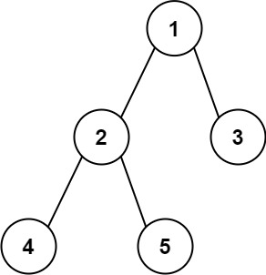

# 543. Diameter of Binary Tree

Given the root of a binary tree, return the length of the diameter of the tree.

The diameter of a binary tree is the length of the longest path between any two nodes in a tree. This path may or may not pass through the root.

The length of a path between two nodes is represented by the number of edges between them.

Example 1:


<br>
Input: root = [1,2,3,4,5]
Output: 3
Explanation: 3 is the length of the path [4,2,1,3] or [5,2,1,3].
Example 2:

Input: root = [1,2]
Output: 1

Constraints:

The number of nodes in the tree is in the range [1, 104].
-100 <= Node.val <= 100

## Solution

#binary-tree #dfs

It performs a depth-first search (DFS) from the root, where the helper function returns the height of the current subtree.  
At each node, it computes the sum of the left and right subtree heights to represent the longest path through that node.  
The `diameter` variable is updated whenever this local path length is greater than the current maximum.  
Finally, it returns the overall maximum diameter found across all nodes.

```javascript
/**
 * Definition for a binary tree node.
 * function TreeNode(val, left, right) {
 *     this.val = (val===undefined ? 0 : val)
 *     this.left = (left===undefined ? null : left)
 *     this.right = (right===undefined ? null : right)
 * }
 */
/**
 * @param {TreeNode} root
 * @return {number}
 */
var diameterOfBinaryTree = function (root) {
  let diameter = 0

  const dfs = (node) => {
    if (!node) return 0

    const leftDepth = dfs(node.left)
    const rightDepth = dfs(node.right)

    diameter = Math.max(diameter, leftDepth + rightDepth)
    return 1 + Math.max(leftDepth, rightDepth)
  }

  dfs(root)

  return diameter
}
```

### 📝 LeetCode Solution

🔗 [View on LeetCode](https://leetcode.com/problems/diameter-of-binary-tree/?envType=problem-list-v2&envId=2mxn884m)

### 📈 Complexity Analysis

- **Time Complexity:** $ O(n) $ <br>
  → It visits each of the $n$ nodes exactly once, performing constant-time calculations at each node.  
  <br>
- **Space Complexity:** $O(n)$ <br>
  → In the worst case (highly unbalanced tree), the recursion stack can grow to $n$ calls.  
  → In a balanced tree, the stack depth is $O(\log n)$.

  <br>
  <br>
