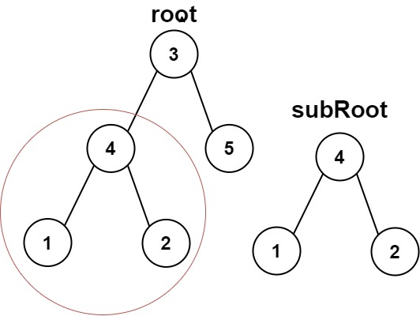
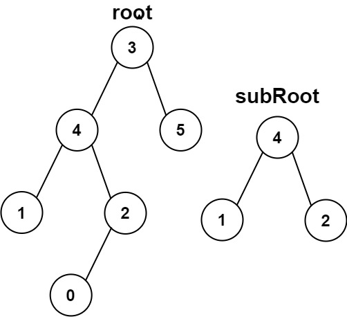

# 572. Subtree of Another Tree

#easy #google #tree #dfs

Given the roots of two binary trees root and subRoot, return true if there is a subtree of root with the same structure and node values of subRoot and false otherwise.

A subtree of a binary tree tree is a tree that consists of a node in tree and all of this node's descendants. The tree tree could also be considered as a subtree of itself.

Example 1:


Input: root = [3,4,5,1,2], subRoot = [4,1,2]
Output: true
Example 2:


Input: root = [3,4,5,1,2,null,null,null,null,0], subRoot = [4,1,2]
Output: false

Constraints:

The number of nodes in the root tree is in the range [1, 2000].
The number of nodes in the subRoot tree is in the range [1, 1000].
-104 <= root.val <= 104
-104 <= subRoot.val <= 104

## Solution

1. isSameTree(node1, node2) recursively checks if two trees are identical:
   - If both nodes are null → trees match at this branch.
   - If one is null or values don’t match → trees differ.
   - Otherwise, recursively compare their left and right children.
2. isSubtree(root, subRoot) Traverses the main tree (root). At each node, checks if the subtree rooted at that node is identical to subRoot. If not, continues searching in the left and right subtrees.

🔁 The algorithm combines tree traversal and tree comparison to determine if subRoot exists somewhere inside root.

```javascript
/**
 * Definition for a binary tree node.
 * function TreeNode(val, left, right) {
 *     this.val = (val===undefined ? 0 : val)
 *     this.left = (left===undefined ? null : left)
 *     this.right = (right===undefined ? null : right)
 * }
 */
/**
 * @param {TreeNode} root
 * @param {TreeNode} subRoot
 * @return {boolean}
 */
const isSameTree = (node1, node2) => {
  if (!node1 && !node2) return true
  if (!node1 || !node2 || node1.val != node2.val) return false
  return (
    isSameTree(node1.left, node2.left) && isSameTree(node1.right, node2.right)
  )
}

var isSubtree = function (root, subRoot) {
  if (!root) return false
  if (isSameTree(root, subRoot)) return true

  return isSubtree(root.left, subRoot) || isSubtree(root.right, subRoot)
}
```

### 📝 LeetCode Solution

🔗 [View on LeetCode](https://leetcode.com/problems/subtree-of-another-tree/submissions/?envType=problem-list-v2&envId=2mxn884m)

### 📈 Complexity Analysis

**Time Complexity:** $ O(n \cdot m) $ <br>
→ In the worst case, we traverse every node in root (n nodes), and for each node, we may call isSameTree, which takes up to O(m) time if subRoot has m nodes.  
→ So total time is O(n \* m) in the worst case.  
**Space Complexity:** $O(n)$ <br>
→ The space used is due to the call stack from recursion.  
→ In the worst case (skewed tree), this is O(n) where n is the height of the main tree.  
→ In a balanced tree, it would be O(log n).
→ If both trees are balanced, space is closer to O(log n + log m), but worst-case is O(n).

  <br>
  <br>
